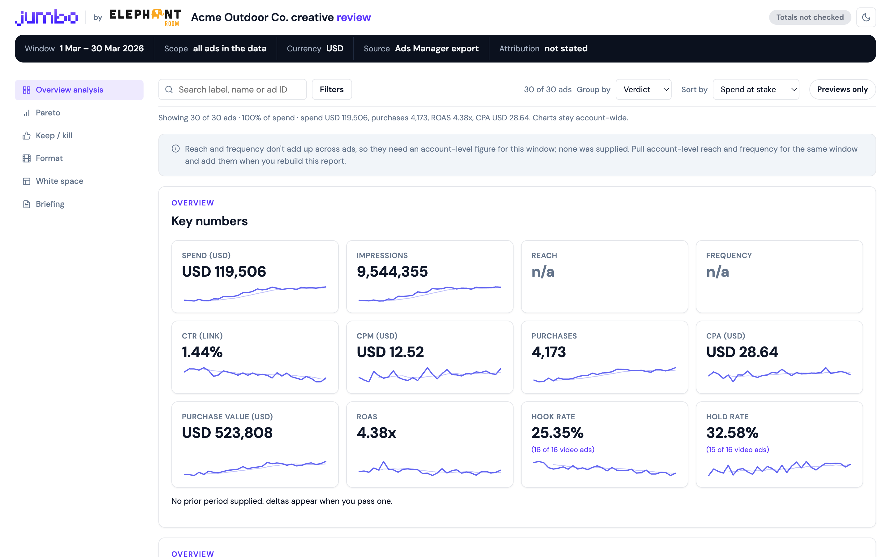
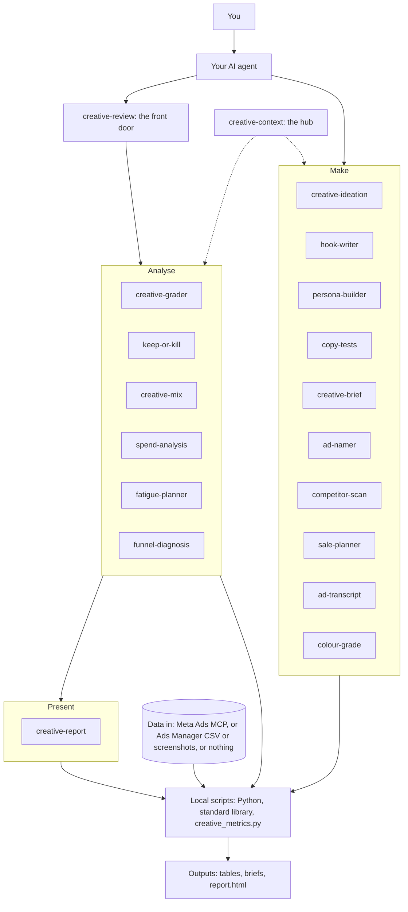

<div align="center">
<h1>Jumbo creative skills</h1>
<p><strong>Teach your AI agent to grade your Meta ads against your own account, and make better ones.</strong></p>
<p>


</p>
<p><a href="#install">Install</a> · <a href="#quick-start">Quick start</a> · <a href="#which-skill-do-i-use">Skills</a> · <a href="docs/how-it-works.md">How it works</a> · <a href="docs/faq.md">FAQ</a></p>
</div>

Skills that teach your AI agent to analyse and make Meta (Facebook and Instagram) ad creative. They grade every ad against your own account's baseline, never against generic benchmarks, and they work for any brand: the brand is something you tell the agent, not something baked in.

<picture>
  <source media="(prefers-color-scheme: dark)" srcset="docs/images/dashboard-dark.png">
  
</picture>

<p align="center"><sub>Made from the fictional Acme Outdoor Co. example. <a href="examples/acme/report.html">Open the full example</a> (download it and open it in a browser).</sub></p>

## What you get

- **Analyse your ads.** One sentence ("review my Meta ads") pulls your data, grades every ad, says which to keep, fix or pause, maps what your creative mix is missing, and names the two or three skills to run next. Then follow the money, plan refreshes before ads wear out, and tell a creative problem from a website problem.
- **Make new creative.** Concepts, hooks, personas, copy tests and production briefs built from what your own ads show (every idea names the ads it came from), a brand profile seeded from public research, a scan of rivals' public ads, ad names to a schema, and sale plans with the offer rules built in.
- **Share the result.** A single HTML dashboard that opens in any browser, prints to PDF and shows what changed since your last review.

## Install

### Claude Code

1. Add the marketplace:

   ```text
   /plugin marketplace add adamsz-er/jumbo-creative-skills
   ```

2. Install the plugin:

   ```text
   /plugin install jumbo-creative@jumbo-creative-skills
   ```

Or from a shell:

```bash
claude plugin marketplace add adamsz-er/jumbo-creative-skills
claude plugin install jumbo-creative@jumbo-creative-skills
```

<details>
<summary>Any agent that supports Agent Skills (Codex, Cursor, Gemini CLI, Copilot and others)</summary>

Run:

```bash
npx skills add adamsz-er/jumbo-creative-skills
```

Add `--skill <name>` to pick one skill, and `-a <agent>` to target one agent.

</details>

<details>
<summary>Claude desktop and claude.ai</summary>

1. Download `<skill>.zip` from the [latest Release](https://github.com/adamsz-er/jumbo-creative-skills/releases/latest).
2. Go to Customize > Skills > Upload and choose the zip. This needs code execution enabled.

Releases appear once the first version is tagged. Until then, build the zips yourself (they land in `dist/`):

```bash
python3 tools/build_zips.py
```

</details>

`jumbo-creative-skills-all.zip` on the Release holds every skill in one file. Installing a single skill works too: each one carries its own copy of the shared code and its own FAQ pointer.

## Quick start

1. **Install** the skills ([steps above](#install)).
2. **Connect your ad data**: add Meta's Ads MCP, or export a CSV from Ads Manager ([how](#connect-your-ad-data)). No data yet? Skip this step.
3. **Ask your agent**, in plain words:

   > Review my Meta ads for the last 28 days.

   The `creative-review` skill pulls the data, checks the totals add up, grades every ad, and replies with three bullets and the path to a dashboard. Run it again later and it also tells you what changed since last time.

No ad data at all? Run it yourself on the made-up Acme Outdoor Co. account:

```bash
python3 -I skills/creative-review/scripts/review.py run --demo
```

> [!TIP]
> No ad data yet? Say "show me a sample review" or run the demo command above.

It writes a run folder under `./creative-review-runs/` holding `report.html`, `summary.md` and the data behind them. Open `report.html` in a browser. A finished example is in [examples/acme/report.html](examples/acme/report.html) (download it and open it in a browser).

## How it fits together



The five moving parts:

- **Skills** are instructions your agent reads. Each one is a folder with a `SKILL.md` and, where needed, scripts and reference notes.
- **Scripts** are small local Python programs (standard library only, no network calls) that do the arithmetic, so numbers are computed, not guessed.
- **The metrics module** (`creative_metrics.py`) is the single definition of every metric. Each skill carries a synced copy so a skill installed on its own still works.
- **Your data source** is Meta's Ads MCP, an Ads Manager CSV or screenshots, or nothing. The skills say which one they used.
- **The outputs** are plain tables and files: grades, verdicts, the mix, briefs, and one `report.html` dashboard.

More depth in [docs/how-it-works.md](docs/how-it-works.md).

## Which skill do I use?

Start with `creative-review`. It runs the analysis and the report in one go, and ends by naming the two or three skills its findings point to.

**I want to...**

- **know how my ads are doing:** `creative-review`, then `keep-or-kill` for the calls and `creative-grader` for the first broken step.
- **know where my money goes and what to move:** `spend-analysis`.
- **know which ads are wearing out and when to refresh:** `fatigue-planner`.
- **know whether a drop is the ad or my website:** `funnel-diagnosis`.
- **know what to make next:** `creative-mix` for the gaps, `competitor-scan` for what rivals run, then `creative-ideation`.
- **write the ad:** `persona-builder` for who, `hook-writer` for the opening, `copy-tests` for the rest of the copy and the test, `creative-brief` for the producer.
- **plan a sale:** `sale-planner`.
- **tidy my ad names:** `ad-namer`.
- **set up the brand:** `creative-context` (it can research the brand from its public site and reviews).

| Your goal | Skill | Example prompt |
|---|---|---|
| Review everything in one go | `creative-review` | "Review my Meta ads for the last 28 days." |
| Set up the brand profile, data and naming | `creative-context` | "Set up my brand profile and check how my ads are named." |
| Find the weak ads and the first step that breaks | `creative-grader` | "Grade my ads and tell me what to fix first." |
| Decide what to pause, fix or scale | `keep-or-kill` | "Which ads should I pause, refresh or scale this week?" |
| See what creative is missing | `creative-mix` | "What creative am I missing, and am I leaning too hard on one thing?" |
| See where the money goes and what to move | `spend-analysis` | "Where is my budget going, and what should I move?" |
| Plan refreshes before ads wear out | `fatigue-planner` | "Which ads are wearing out? Plan refreshes at two new ads a week." |
| Tell a creative problem from a site problem | `funnel-diagnosis` | "Sales dropped but clicks held. Is it the ad or the website?" |
| See what competitors run | `competitor-scan` | "What angles are my competitors running, and where is the open ground?" |
| Get new ad ideas | `creative-ideation` | "Give me nine ad concepts that fill the gaps in my mix." |
| Write hooks | `hook-writer` | "Write hooks for my rain shell, and variants of the ad that is fatiguing." |
| Know who you are talking to | `persona-builder` | "Who is responding to my ads? Build me personas from the results." |
| Write copy variants and size the test | `copy-tests` | "Write three headline variants and tell me if my account can power the test." |
| Name ads, or tidy existing names | `ad-namer` | "Give me a rename plan so every ad carries its funnel stage." |
| Plan a sale or choose an offer | `sale-planner` | "Plan our Black Friday sale, and did last month's sale make money?" |
| Brief a creator or editor | `creative-brief` | "Write a production brief for the boot test with a new opening." |
| Tighten a video script | `ad-transcript` | "Break this script into beats and tighten it." |
| Read the colour of your ads | `colour-grade` | "What does the palette of these ads say, and do they all look alike?" |
| Share the results | `creative-report` | "Put this review in a report I can share." |

## A typical workflow

1. **`creative-review`**: draft the brand profile from your data (you correct it once), then grade, keep or kill, mix and report in one run. On repeat runs the dashboard opens with "What changed since last time". It ends with the next skills its findings point to.
2. **`spend-analysis`** and **`fatigue-planner`**: move money off what is not working, and schedule refreshes before your winners wear out.
3. **`creative-ideation`**: turn the gaps in the mix (and the open ground from `competitor-scan`) into concepts, each naming the ads or gap it came from.
4. **`hook-writer`** and **`copy-tests`**: write the openings and the copy, one change per variant, and check the account can power the test.
5. **`creative-brief`**: turn a concept and its hook into a production brief with the evidence behind it, named with `ad-namer`.

Each analysis skill can also be run on its own (grade, keep or kill, mix, report).

## Connect your ad data

The skills read your own numbers. Pick whichever you have:

1. **Meta's official Ads MCP** (recommended). Add the connector at `https://mcp.facebook.com/ads` in your agent and sign in with Meta through OAuth. In Claude Code:

   ```bash
   claude mcp add --transport http meta-ads https://mcp.facebook.com/ads
   ```

   Then authenticate from `/mcp`. It may not be enabled on every ad account yet. Some metrics need care (3-second plays are derived, long pulls can stop short): see [Known limits](#known-limits) and the [FAQ](docs/faq.md#data-and-connections).
2. **A CSV export from Ads Manager** as the fallback. Follow [the export recipe](skills/creative-context/references/export-recipe.md) for the exact columns.
3. **Nothing.** The skills still work for ideation, and label every grade "no performance data".

> [!IMPORTANT]
> These skills only read. They never call a tool that changes your ad account. `ad-namer` writes a rename plan for you to apply; it renames nothing. Your agent could, if you asked it to directly, through the Meta connector's own tools.

## What the numbers mean

Every metric id and formula is defined once, in [skills/creative-context/references/metrics.md](skills/creative-context/references/metrics.md). In short:

- **Hook rate**: of the times the ad was shown, how often it was watched for at least 3 seconds. Also called thumb-stop rate.
- **Hold rate**: of the 3-second watches, how many went on to a ThruPlay (Meta's measure for a long watch).
- **CTR**: clicks divided by impressions. Each output says whether it counted link clicks or all clicks.
- **CPA**: cost per purchase (spend divided by purchases).
- **ROAS**: return on ad spend (purchase value divided by spend).
- **Frequency**: average times each person saw the ad.

A missing field or a zero denominator is shown as `n/a (missing <field>)`, never 0.

> [!NOTE]
> Every ad is graded against your own account, never an industry benchmark. Its comparison is the median and quartiles of similar ads in your account, over the same window.

## Known limits

<details>
<summary>Ten things to know before you rely on the numbers</summary>

- Meta's ads connector does not return 3-second plays per ad. The skills derive them from the cost per 3-second view and label them "(derived)". When that cost is rounded too coarsely to trust, hook and hold rate show n/a with the reason, and an Ads Manager export fills them in.
- A long connector pull can stop partway with no warning. The review reconciles the pulled spend and impressions against account totals and stops with a clear message when the pull is short.
- Ad-name detection reads common conventions (positional, or `KEY:value` segments). Names that follow neither are reported as unclassified until you give a key map. See the [FAQ](docs/faq.md#metrics-and-grading).
- The beat detection in `ad-transcript` is a keyword heuristic: treat it as a first pass over a script, not a verdict.
- Small comparison groups give an early read, and the output says so. Very new ads are marked "too early to judge".
- Reach and frequency do not add up across ads, so they show n/a unless you supply an account-level figure for the same scope.
- `competitor-scan` sorts rivals' ads into angles, hook types and offers with keyword rules: a first pass to read and correct, not a verdict. It can only see that an ad exists and how long it has run, never its results.
- `fatigue-planner`'s days left is a straight line through an ad's recent days, with its range. Real ads rarely fade in a straight line: treat it as a planning date.
- The site side of `funnel-diagnosis` (and keep-or-kill's site check) needs landing page views, adds to cart or checkouts initiated in the export; without them it says so rather than calling the site fine.
- Ad previews: the connector returns links, not image files, so cards show placeholders unless you save screenshots as `<ad_id>.png`. Palette extraction reads PNG without extra software; other image formats need Pillow (optional).

</details>

## Learn more

- [How it works](docs/how-it-works.md): data modes, the shared metrics code, how grading works, every command-line flag, the report.
- [FAQ](docs/faq.md): short answers to common questions.
- [Troubleshooting](docs/troubleshooting.md): a symptom, its cause and the fix.
- [Worked examples](examples/acme/) on the fictional Acme Outdoor Co., including the [dashboard](examples/acme/report.html) (download it and open it in a browser).
- [Changelog](CHANGELOG.md).

## Privacy

The skills run inside your agent. The scripts run on your machine and make no network calls. But your AI agent sends what it reads, including your ad data and the results, to its AI provider, the same as anything else you share in a chat. The Meta connector is Meta's own service. The scripts use only the Python standard library. `colour-grade` reads other image formats too if you have Pillow installed, and the report is one local HTML file whose only outside requests are to Google Fonts (the stylesheet and font files).

## Updating

**Claude Code:**

```bash
claude plugin marketplace update jumbo-creative-skills
```

**Other agents:** re-run the install command you used.

**Claude desktop and claude.ai:** download the new zips from the latest Release and upload them again.

## Contributing

Standard library only, no network calls in scripts. Before you open a pull request:

```bash
python3 -m unittest discover -s tests -v
python3 tools/validate_skills.py
python3 tools/sync_shared.py --check     # run without --check to copy shared/ into the skills
```

Rules: no client data, ever (examples use the fictional Acme Outdoor Co. and the synthetic fixture); no benchmarks; metric ids and formulas live only in `creative-context/references/metrics.md` and `shared/creative_metrics.py`. See [AGENTS.md](AGENTS.md).

## License

MIT. See [LICENSE](LICENSE).
