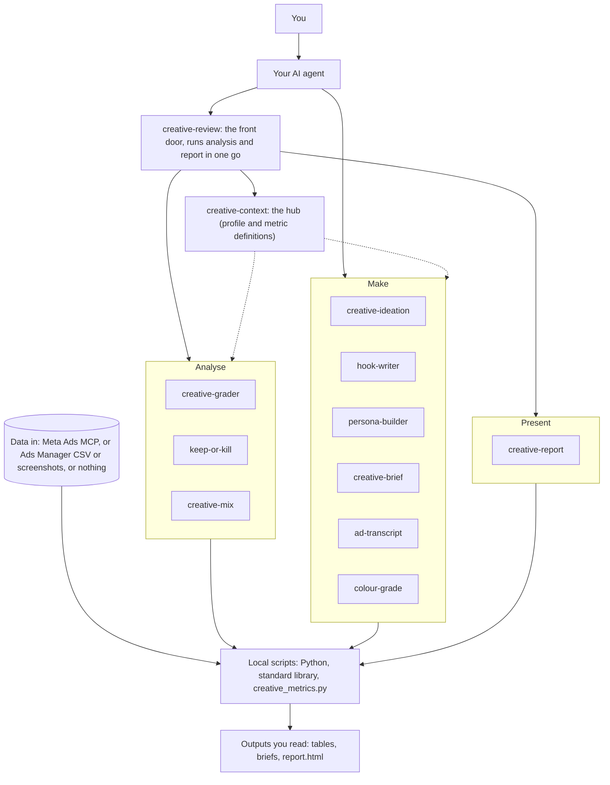

# jumbo-creative-skills

Skills that teach your AI agent to analyse and make Meta (Facebook and Instagram) ad creative. They grade every ad against your own account's baseline, never against generic benchmarks, and they work for any brand: the brand is something you tell the agent, not something baked in.

## What you get

- **Analyse your ads.** One sentence ("review my Meta ads") pulls your data, grades every ad, says which to keep, fix or pause, and maps what your creative mix is missing.
- **Make new creative.** Concepts, hooks, personas and production briefs built from what your own ads show, with a script breakdown and a colour read when you bring a script or images.
- **Share the result.** A single HTML dashboard that opens in any browser, prints to PDF and shows what changed since your last review.

## Install

| Where | How |
|---|---|
| Claude Code | `/plugin marketplace add adamsz-er/jumbo-creative-skills` then `/plugin install jumbo-creative@jumbo-creative-skills`. From a shell: `claude plugin marketplace add adamsz-er/jumbo-creative-skills` then `claude plugin install jumbo-creative@jumbo-creative-skills` |
| Any agent that supports Agent Skills (Claude Code, Codex, Cursor, Gemini CLI, Copilot and others) | `npx skills add adamsz-er/jumbo-creative-skills`. Add `--skill <name>` to pick one skill, `-a <agent>` to target one agent |
| Claude desktop / claude.ai | Download `<skill>.zip` from the [latest Release](https://github.com/adamsz-er/jumbo-creative-skills/releases/latest), then Customize > Skills > Upload. Needs code execution enabled. Releases appear once the first version is tagged; until then build the zips yourself with `python3 tools/build_zips.py` (they land in `dist/`) |

`jumbo-creative-skills-all.zip` on the Release holds every skill in one file. Installing a single skill works too: each one carries its own copy of the shared code and its own FAQ pointer.

## Quick start

1. **Install** the skills (table above).
2. **Connect your ad data**: add Meta's Ads MCP, or export a CSV from Ads Manager ([how](#connect-your-ad-data)). No data yet? Skip this step.
3. **Ask your agent**, in plain words:

   > Review my Meta ads for the last 28 days.

   The `creative-review` skill pulls the data, checks the totals add up, grades every ad, and replies with three bullets and the path to a dashboard. Run it again later and it also tells you what changed since last time.

No ad data at all? Say "show me a sample review", or run it yourself on the made-up Acme Outdoor Co. account:

```
python3 -I skills/creative-review/scripts/review.py run --demo
```

It writes a run folder under `./creative-review-runs/` holding `report.html`, `summary.md` and the data behind them. Open `report.html` in a browser. A finished example is in [examples/acme/report.html](examples/acme/report.html) (download it and open it in a browser).

## How it fits together



The five moving parts:

- **Skills** are instructions your agent reads. Each one is a folder with a `SKILL.md` and, where needed, scripts and reference notes.
- **Scripts** are small local Python programs (standard library only, no network calls) that do the arithmetic, so numbers are computed, not guessed.
- **The metrics module** (`creative_metrics.py`) is the single definition of every metric. Each skill carries a synced copy so a skill installed on its own still works.
- **Your data source** is Meta's Ads MCP, an Ads Manager CSV or screenshots, or nothing. The skills say which one they used.
- **The outputs** are plain tables and files: grades, verdicts, the mix, briefs, and one `report.html` dashboard.

More depth in [docs/how-it-works.md](docs/how-it-works.md).

## Which skill do I use?

| Your goal | Skill | Example prompt |
|---|---|---|
| Review everything in one go | `creative-review` | "Review my Meta ads for the last 28 days." |
| Set up the brand profile, data and naming | `creative-context` | "Set up my brand profile and check how my ads are named." |
| Find the weak ads and the first step that breaks | `creative-grader` | "Grade my ads and tell me what to fix first." |
| Decide what to pause, fix or scale | `keep-or-kill` | "Which ads should I pause, refresh or scale this week?" |
| See what creative is missing | `creative-mix` | "What creative am I missing, and am I leaning too hard on one thing?" |
| Get new ad ideas | `creative-ideation` | "Give me nine ad concepts that fill the gaps in my mix." |
| Write hooks | `hook-writer` | "Write hooks for my rain shell, and variants of the ad that is fatiguing." |
| Know who you are talking to | `persona-builder` | "Who am I really talking to? Build me personas for this brand." |
| Brief a creator or editor | `creative-brief` | "Write a production brief for the boot test with a new opening." |
| Tighten a video script | `ad-transcript` | "Break this script into beats and tighten it." |
| Read the colour of your ads | `colour-grade` | "What does the palette of these ads say, and do they all look alike?" |
| Share the results | `creative-report` | "Put this review in a report I can share." |

## A typical workflow

1. **`creative-review`**: draft the brand profile from your data (you correct it once), then grade, keep or kill, mix and report in one run. On repeat runs the dashboard opens with "What changed since last time".
2. **`creative-ideation`**: turn the gaps in the mix into concepts.
3. **`hook-writer`**: write hooks for the concepts you like, and one-change variants of a winner.
4. **`creative-brief`**: turn a concept and its hook into a production brief with the evidence behind it.

Each analysis skill can also be run on its own (grade, keep or kill, mix, report).

## Connect your ad data

The skills read your own numbers. Pick whichever you have:

1. **Meta's official Ads MCP** (recommended). Add the connector at `https://mcp.facebook.com/ads` in your agent and sign in with Meta through OAuth. In Claude Code: `claude mcp add --transport http meta-ads https://mcp.facebook.com/ads`, then authenticate from `/mcp`. It may not be enabled on every ad account yet. It is read-only for these skills: they never call a tool that changes an ad. Some metrics need care (3-second plays are derived, long pulls can stop short): see [Known limits](#known-limits) and the [FAQ](docs/faq.md#data-and-connections).
2. **A CSV export from Ads Manager** as the fallback. Follow [the export recipe](skills/creative-context/references/export-recipe.md) for the exact columns.
3. **Nothing.** The skills still work for ideation, and label every grade "no performance data".

## What the numbers mean

Every metric id and formula is defined once, in [skills/creative-context/references/metrics.md](skills/creative-context/references/metrics.md). In short:

- **Hook rate**: of the people who saw the ad, how many watched at least 3 seconds. Also called thumb-stop rate.
- **Hold rate**: of those who watched 3 seconds, how many watched to ThruPlay (Meta's measure for a long watch).
- **CTR**: clicks divided by impressions. Each output says whether it counted link clicks or all clicks.
- **CPA**: cost per purchase (spend divided by purchases).
- **ROAS**: return on ad spend (purchase value divided by spend).
- **Frequency**: average times each person saw the ad.

A missing field or a zero denominator is shown as `n/a (missing <field>)`, never 0. And the rule behind every grade: **an ad is graded against your own account, never an industry benchmark.** Its comparison is the median and quartiles of similar ads in your account, over the same window.

## Known limits

- Meta's ads connector does not return 3-second plays per ad. The skills derive them from the cost per 3-second view and label them "(derived)". When that cost is rounded too coarsely to trust, hook and hold rate show n/a with the reason, and an Ads Manager export fills them in.
- A long connector pull can stop partway with no warning. The review reconciles the pulled spend and impressions against account totals and stops with a clear message when the pull is short.
- Ad-name detection reads common conventions (positional, or `KEY:value` segments). Names that follow neither are reported as unclassified until you give a key map. See the [FAQ](docs/faq.md#metrics-and-grading).
- The beat detection in `ad-transcript` is a keyword heuristic: treat it as a first pass over a script, not a verdict.
- Small comparison groups give an early read, and the output says so. Very new ads are marked "too early to judge".
- Reach and frequency do not add up across ads, so they show n/a unless you supply an account-level figure for the same scope.
- Ad previews: the connector returns links, not image files, so cards show placeholders unless you save screenshots as `<ad_id>.png`. Palette extraction reads PNG without extra software; other image formats need Pillow (optional).
- The skills read and advise. They never change your account.

## Learn more

- [How it works](docs/how-it-works.md): data modes, the shared metrics code, how grading works, every command-line flag, the report.
- [FAQ](docs/faq.md): short answers to common questions.
- [Troubleshooting](docs/troubleshooting.md): a symptom, its cause and the fix.
- [Worked examples](examples/acme/) on the fictional Acme Outdoor Co., including the [dashboard](examples/acme/report.html) (download it and open it in a browser).
- [Changelog](CHANGELOG.md).

## Privacy

The skills run inside your agent. The bundled scripts use only the Python standard library and make no network calls, so your data leaves your machine only through what your agent and the Meta MCP already do. `colour-grade` reads other image formats too if you have Pillow installed, and the report is one local HTML file whose only outside requests are to Google Fonts (the stylesheet and font files).

## Updating

- **Claude Code:** `/plugin marketplace update jumbo-creative-skills`, then reinstall or reload the plugin if prompted.
- **Other agents:** run `npx skills add adamsz-er/jumbo-creative-skills` again.
- **Claude desktop / claude.ai:** download the new zips from the latest Release and upload them again.

## Contributing

Standard library only, no network calls in scripts. Before you open a pull request:

```
python3 -m unittest discover -s tests -v
python3 tools/validate_skills.py
python3 tools/sync_shared.py --check     # run without --check to copy shared/ into the skills
```

Rules: no client data, ever (examples use the fictional Acme Outdoor Co. and the synthetic fixture); no benchmarks; metric ids and formulas live only in `creative-context/references/metrics.md` and `shared/creative_metrics.py`. See [AGENTS.md](AGENTS.md).

## License

MIT. See [LICENSE](LICENSE).
